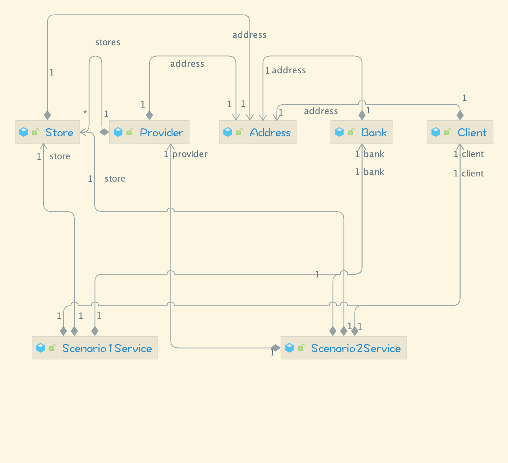

## TAA Lab 3 - Part 1 - Dependency Injection in Spring

### Presentation

This repo contains works about the first part of the third lab, which addresses to the DI feature of Spring.

The goal of this lab is to understand the idea of dependency injection. In this lab, the working scenario is around a simple case study of a shop with customers and providers. The model contains 4 data classes' definitions, however, there is no direct object allocation nor direct dependency in the code. The instantiation of values are passed by interfaces.

In this way, the logics of each layer are decoupled, which respect the open-close principle and make the project less rigid therefore easier to maintain and to be extended.

We use Spring's `@Autowired` annotation to achieve this idea.

There is a difference of choice between the course's demo video and our code.

-   In the demo video, all types in model contains direct references to other interfaces. This does not mean that they are instantiated as object directly.
-   As a contrast, in our code, all types are just simple data types with some properties but those autowired references are put into services.

There are two services corresponding to scenario 1 and 2. Each service contains an `act` method which is quite heavy since it do lots of works to process a scenario's actions. A better structure may be to create "middle-level" methods that interact with different data types in each service, or just in the interface as default implementations, to do checking and handling stuff. In this way, the `act` methods could be more elegant.

In our case, the `IRun` protocol of `Client` could be useless as we make the call via services instead of `Client`. We can declare a protocol `IService` to autowire a service, but this seems to be useless as we may have multiple services and Spring cannot autowire a protocol that have multiple inherited types at a time.

In fact the code won't run as we lack concrete info to make the store i.e. the DB and network stuff. Nevertheless, it could already show some interesting aspects of the Spring DI.

### Structure

The UML diagram is the following:

This diagram is in a view containing two parts: the model layer and the service layer. It's worth nothing that all references to the autowired properties are marked with a 1-1 relation.